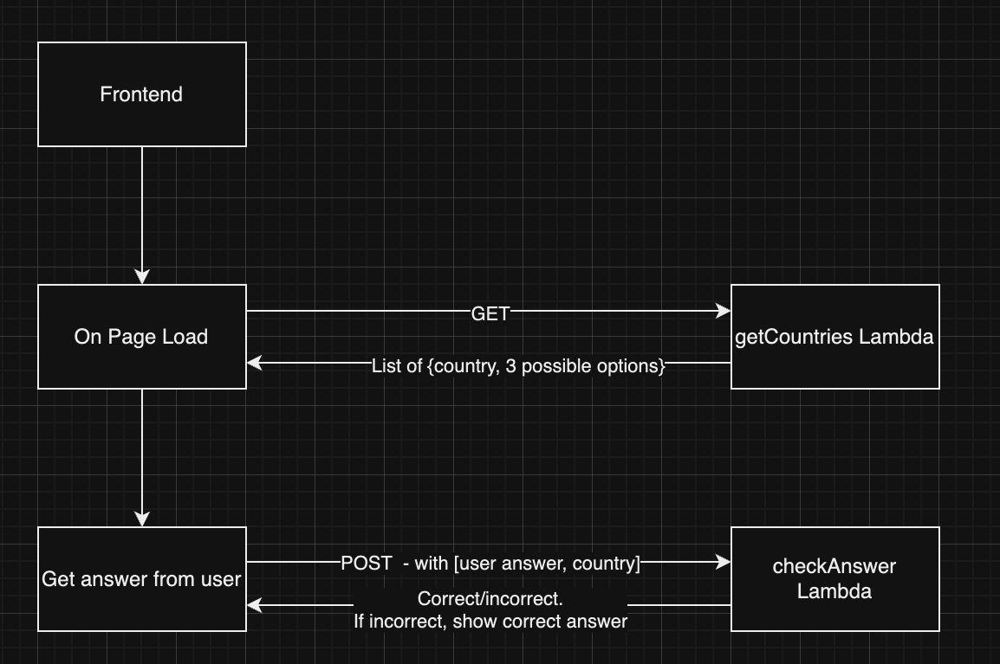
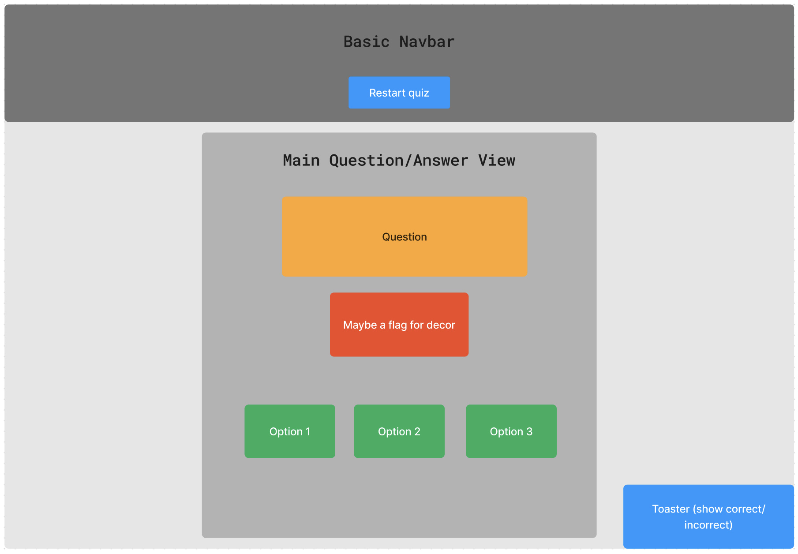

# Capital City Quizzer

This is an app to quiz people on capitals of the world.

On page load, the app will find a random country to quiz you on. But you have the option to repeat the quiz. If you get the answer wrong, the correct one will get highlighted.

## Getting started

- Install `pnpm` if you haven't already:

  > _https://pnpm.io/installation_

- In the project root, run:

  > `$ pnpm i`

- Run the backend first:

  > `$ pnpm backend`

- Run the frontend along side the backend:

  > `$ pnpm frontend`

## Packages

### `lambda`

- The backend is made up of lambda functions using the serverless (offline) framework.
- I am using Zod here for ensuring object types match at runtime e.g. when I'm making API calls to `countriesnow.space`. This makes it easier to pinpoint object shape mismatch errors on the server.
- I decided to use `serverless offline` for lambdas as it is a quick setup for APIs and helps keep things nice and modular, allowing me to scale (add functions) horizontally.
- The `integrations` folder contains the code that is responsible for interfacing with 3rd party libraries.
- Using `winston` logger to make server logging easier and nicer. It also provides timestamps and info/warning/error coloring which is useful if errors occur for a user and they report it. We can then analyze logs and pinpoint the issue.

#### Security measures

- We should check the answers on the backend so that the user can't see the correct ones. Create a seperate lambda function so that we can do this.
- In addition to this, I realized that the initial data sent to the frontend may assist in getting the correct answer, so to combat this, we can send back just the country, and the 3 options.

Primitive flow for this:

#### Lambda Functions

- `get-questions`: We fetch all the countries in the format `[{name: ..., capital: ...}, ...]` then generates questions like: `[{name: ..., options: [capital1, capital2, capital3]}, ...]`. One of the capitals will be the correct answer.
- `check-option`: Get the correct capital and test against the user-provided one. Doing this on the lambda ensures that the user cannot see the correct answer. Users may still be able to programmatically query the lambda.
- `get-flag`: Fetch the flag URL of a given country.

### `frontend`

Navigate to `/play` (but `/` should just redirect to `play`) to see the app in action.

- A Next.js app with Tailwind CSS and shadcn/ui (\*).
- The sizing etc. works pretty well until a minimum screen width of about 300px.
- The feedback is given via toast messages.

Rough frontend template:

_(\*) shadcn/ui is a UI component library that allows you to insert premade customisable components into `@/components/ui` https://ui.shadcn.com._

### Possible improvements/future ideas

- To limit API calls, we can use caching mechanisms like Redis to store the API response JSON in a docker service or other.
- Cache the user answers (also possibly in Redis) along with a user ID and limit that user ID to ensure a user doesn't try to brute-force answers.
- Since the API provides all the country data in one request, we can store these in a database so that we can move away from using an API for constant data. This will give us control of our data format (i.e. in case the API changes the structure of their data) and may result in faster function calls as we aren't calling an extra API.

### Libraries used

- axios
- shadcn-ui
- React
- serverless/serverless-offline
- jest (for unit testing)
- zod

## To run test suite

- Run `pnpm test` in the root of the project.
